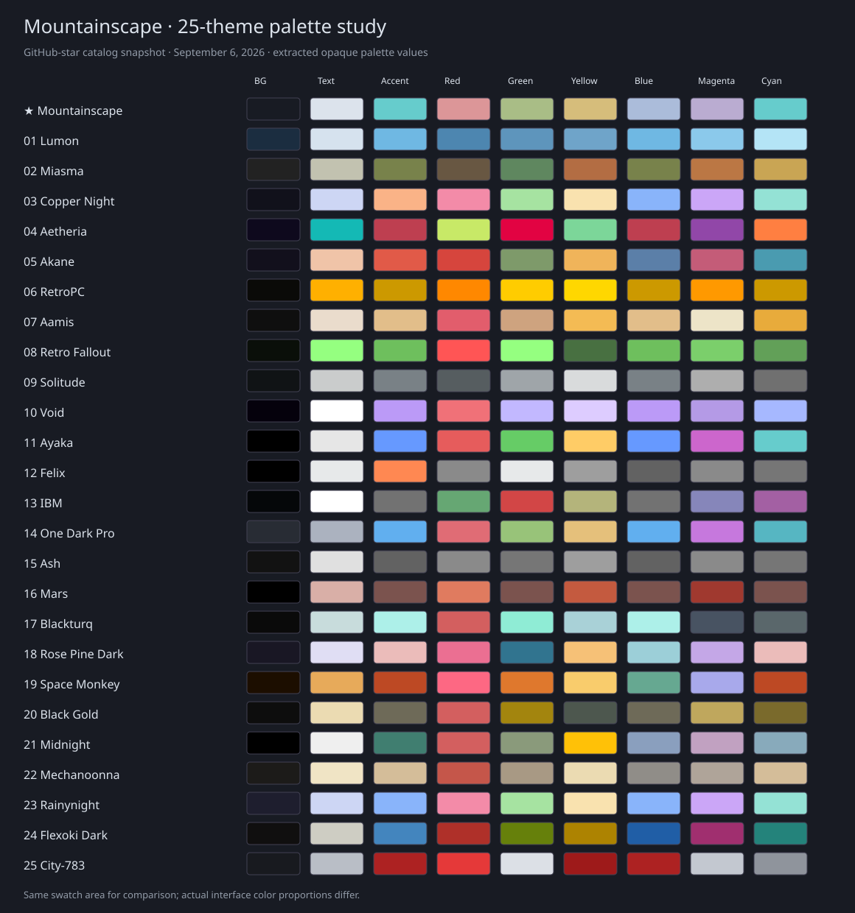

# Mountainscape: 25-theme benchmark

Reviewed September 6, 2026. **Recommendation: retain the palette and refine role mappings.** Mountainscape already has the restrained surfaces, clear identity, and cool/warm balance that recur in the strongest references. Popularity is a selection method, not a quality score.

## Sample and evidence

The original [OmarchyThemes.com](https://omarchythemes.com/) directory is alphabetical. This study uses the first 25 community entries in the GitHub-star sort at [OmarchyTheme.com](https://www.omarchytheme.com/themes/), the similarly named directory that exposes star sorting. Counts are the gallery's September 6 snapshot, backed by its [public registry](https://github.com/limehawk/omarchy-theme-website/blob/main/src/data/themes-data.json), not a live guarantee. Ties retain gallery order. Built-in entries were excluded because they share the Omarchy distribution repository's star count rather than having independently comparable theme repositories. This ranks themes in that catalog, not every theme on GitHub.

Each repository's palette and available application configurations were inspected. Twenty-three repository previews were available; Copper Night was assessed using the gallery thumbnail, and Rosé Pine Dark is source-only. Some previews show chiefly wallpaper, and screenshots can predate current source. They establish visual references, not proof of present runtime compatibility. An AI design consultant independently reviewed ranks 14–25 and the Mountainscape visual study; no human designer consultation is claimed.

The [measurement data](docs/benchmark-data.json) preserves palette values, source filenames, retrieval timestamps, and Git blob hashes for traceability. Twenty-one themes supply colors.toml; four were normalized from Alacritty. For those four, bright.black is a secondary-text proxy, not a verified editor comment color. Palette files were read as data; downloaded theme code was not executed.

## The full ranked sample

“Text” is foreground against the main opaque background, not a whole-app accessibility rating.

| Rank | Theme | Stars | Text contrast | Design lesson |
| ---: | --- | ---: | ---: | --- |
| 1 | [Lumon](https://github.com/OldJobobo/omarchy-lumon-theme) | 166 | 10.68:1 | Blue tonal consistency creates a strong identity; preserve more distinction between semantic colors. |
| 2 | [Miasma](https://github.com/OldJobobo/omarchy-miasma-theme) | 120 | 8.82:1 | Olive, ochre, and charcoal repeat naturally across chrome and content; borrow the restrained saturation. |
| 3 | [Copper Night](https://github.com/hembramnishant50-glitch/omarchy-coppernight-theme) | 98 | 12.97:1 | Copper accents over violet charcoal show how warmth can connect dark UI to a landscape. |
| 4 | [Aetheria](https://github.com/JJDizz1L/aetheria) | 91 | 8.03:1 | Neon teal, pink, and lime create energy; the higher chroma is less suited to a calm mountain workspace. |
| 5 | [Akane](https://github.com/Grenish/omarchy-akane-theme) | 85 | 11.79:1 | Warm peach and red-orange balance violet shadows; useful precedent for our cool/warm balance. |
| 6 | [RetroPC](https://github.com/rondilley/omarchy-retropc-theme) | 80 | 10.82:1 | Amber-on-black is instantly recognizable; monochrome identity trades away semantic distinction. |
| 7 | [Aamis](https://github.com/vyrx-dev/omarchy-aamis-theme) | 78 | 14.25:1 | Quiet charcoal framing and parchment tones leave room for the wallpaper. |
| 8 | [Retro Fallout](https://github.com/zdravkodanailov7/omarchy-retro-fallout-theme) | 73 | 15.57:1 | Phosphor-green source colors provide a strong motif; the fetched blue preview may predate the current palette. |
| 9 | [Solitude](https://github.com/HANCORE-linux/omarchy-solitude-theme) | 61 | 11.56:1 | Almost-gray surfaces let artwork lead; keep more color differentiation in meaningful content. |
| 10 | [Void](https://github.com/vyrx-dev/omarchy-void-theme) | 60 | 20.67:1 | Purple-black and lilac create a tight tonal family; avoid independently drifting application backgrounds. |
| 11 | [Ayaka](https://github.com/abhijeet-swami/omarchy-ayaka-theme) | 56 | 16.83:1 | Distinct content colors work well on black; source app accents vary, illustrating the need for consistent roles. |
| 12 | [Felix](https://github.com/TyRichards/omarchy-felix-theme) | 55 | 17.24:1 | Grayscale chrome recedes effectively; do not remove syntax distinctions merely for uniformity. |
| 13 | [IBM](https://github.com/DimaZbr/omarchy-ibm-theme) | 52 | 20.18:1 | Red brand accents and neutral framing coexist with a conventional semantic ANSI palette. |
| 14 | [One Dark Pro](https://github.com/sc0ttman/omarchy-one-dark-pro-theme) | 51 | 6.57:1 | Blue-gray surfaces support broad syntax colors; keep comments more readable than the source pair (2.32:1). |
| 15 | [Ash](https://github.com/bjarneo/omarchy-ash-theme) | 49 | 14.19:1 | Grayscale discipline is calm, but duplicate ANSI categories lose useful distinctions. |
| 16 | [Mars](https://github.com/steve-lohmeyer/omarchy-mars-theme) | 49 | 10.64:1 | Dusty rose and orange strongly connect to the landscape; separately test selection states (source pair 1.69:1). |
| 17 | [Blackturq](https://github.com/HANCORE-linux/omarchy-blackturq-theme) | 48 | 13.88:1 | Aqua on black is a close relative; borrow restrained teal focus, while keeping titles readable (source pair 2.54:1). |
| 18 | [Rose Pine Dark](https://github.com/guilhermetk/omarchy-rose-pine-dark) | 48 | 13.39:1 | Violet neutrals with rose, gold, and cyan balance warmth and coolness; selected text needs separate checking (2.25:1). |
| 19 | [Space Monkey](https://github.com/TyRichards/omarchy-space-monkey-theme) | 46 | 9.26:1 | Geometry and material reinforce color identity; preserve our understated geometry instead of adding broad behavior overrides. |
| 20 | [Black Gold](https://github.com/HANCORE-linux/omarchy-blackgold-theme) | 45 | 14.17:1 | Cream text and gold-on-black form a clear hierarchy; avoid overly dim secondary labels (btop title 2.58:1). |
| 21 | [Midnight](https://github.com/JaxonWright/omarchy-midnight-theme) | 45 | 18.26:1 | Small teal accents stand out against black and white; ensure named surface and text ramps have ordered brightness. |
| 22 | [Mechanoonna](https://github.com/HANCORE-linux/omarchy-mechanoonna-theme) | 44 | 13.61:1 | Stone, amber, and cream echo the artwork; related external editor schemes are not exact palette synchronization. |
| 23 | [Rainynight](https://github.com/atif-1402/omarchy-rainynight-theme) | 44 | 11.34:1 | Soft blue-violet framing is calm; its related but different app palettes argue for a shared source of truth. |
| 24 | [Flexoki Dark](https://github.com/euandeas/omarchy-flexoki-dark-theme) | 43 | 11.98:1 | Ink-like surfaces and restrained distinct colors keep content dominant; different chart roles can retain different hues. |
| 25 | [City-783](https://github.com/OldJobobo/omarchy-city-783-theme) | 42 | 9.32:1 | Separating decorative red from readable text red is a strong model for assigning colors by role. |

## What the numbers actually show

- All 25 sampled main backgrounds have OKLCH chroma below 0.05. Quiet backgrounds are the most consistent quantitative pattern in this sample.
- All 25 main foreground/background pairs exceed 4.5:1; their median is 12.97:1. Mountainscape is 13.31:1.
- The median muted/bright-black proxy contrast is 2.81:1. Only three reach 4.5:1. That is a reason to inspect secondary text carefully, not evidence that every application in the other themes fails: roles, editor schemes, and disabled text differ.
- Mountainscape's comments reach 5.77:1 on the main surface and 4.59:1 on the corrected current-line surface.
- Mean chroma across the six normal chromatic ANSI slots is 0.0747 for Mountainscape versus a sample median of 0.098. Our content palette is restrained without becoming monochrome. Every one of those six Mountainscape colors exceeds 7.26:1 against the main surface.

The swatch study below uses extracted palette data rather than reproducing other authors' screenshots. Column order: background, foreground, accent, red, green, yellow, blue, magenta, cyan. Legacy accent assignments follow the gallery registry where the terminal file has no explicit accent role.

## Is color preference all mathematics?

No. Mathematics can measure contrast and describe hue, lightness, and chroma relationships. It cannot prove elegance or predict every person's preference. Color area, adjacency, wallpaper brightness, typography, display conditions, and what a color means in the interface affect the result.

[OKLCH](https://www.w3.org/TR/css-color-4/) gives useful perceptual coordinates. Mountainscape's teal has hue 195.4° and its dusty rose 17.4°: their shortest separation is **177.97°**, almost an exact complementary pair. Teal's chroma is 0.095; rose is 0.085. Their restrained saturation lets the relationship work without a harsh red/cyan effect. This is a useful description of the current design, not a rule requiring every theme to use complementary colors.

The six semantic ANSI colors span lightness 0.743–0.805, which helps balance their visual weight. Main and raised backgrounds have very low chroma, 0.016 and 0.026. Near-neutral hue angles are unstable and should not dominate a harmony score. Raising saturation or forcing exact hue spacing would make the palette less faithful to the photographs.

[WCAG contrast](https://www.w3.org/WAI/WCAG21/Understanding/contrast-minimum.html) supplies a practical 4.5:1 reference for ordinary text. It does not score beauty. Ratios here use sRGB relative luminance and opaque colors; wallpaper visible through translucent windows changes the effective background.

## Application to Mountainscape

1. **Keep blue-charcoal as the dominant surface family.** The mountain shadows connect all four photographs. Bright sky and snow should remain in the wallpaper rather than becoming large bright application panels.
2. **Repeat teal for interaction.** Focus, primary actions, and selections share an identity. Powder blue supports secondary emphasis. A teal text label and a teal filled button need different foreground/background decisions.
3. **Keep meaningful content colors.** Moss, gold, rose, and lavender remain distinct for success, warning, error, and syntax. Uniform teal graphs or monochrome ANSI would reduce useful distinctions. Stock btop categorical and temperature hues remain intentional.
4. **Preserve the repaired brightness ramp.** Snow-tinted light foreground now follows normal foreground; powder blue keeps its separate accent role. Sequential graph ramps should progress in brightness, while semantic temperature ramps may deliberately move toward red.
5. **Keep targeted state corrections.** VS Code secondary buttons, hover states, and filled controls now use appropriate foreground/background pairs. The optional Neovim adjustment repairs washed-out current-line and completion selections. The [visual review](REVIEW.md) records actual contrast results and the native editor capture.
6. **Keep one source palette.** Follow DHH's compact [Giants](https://github.com/dhh/omarchy-giants-theme) and [Zonda Zoom](https://github.com/dhh/omarchy-zonda-zoom-theme) approach; use Omarchy's generated coverage and small documented exceptions. A large count of legacy configuration files is not evidence of better support for installed Omarchy 4.
7. **Keep the name Mountainscape.** One word reads naturally as a landscape name and matches the repository and picker. The old “Alpine Dark” preview subtitle has been removed.

The benchmark supports the refinements already applied; it does not justify another palette replacement or broader desktop behavior changes. All four renamed wallpapers remain available. The theme is installed locally and the GitHub repository remains private pending the user's release decision.
