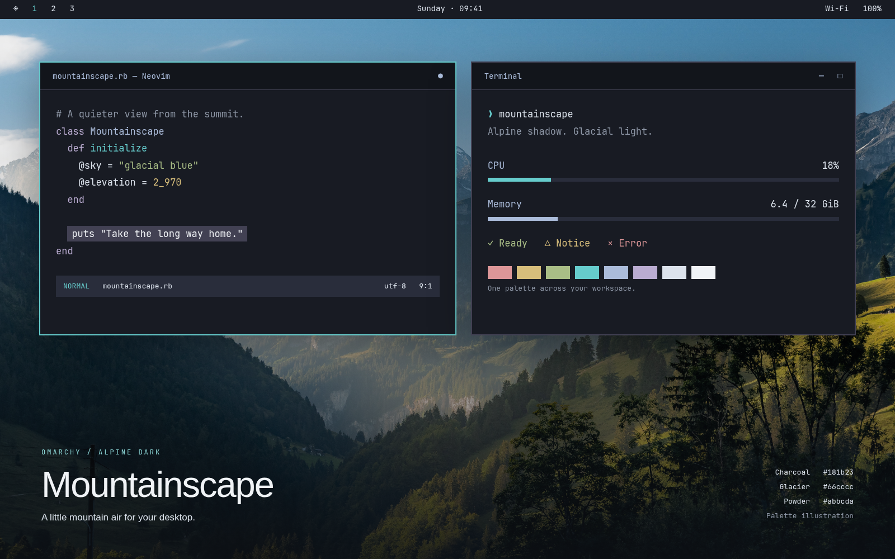

# Mountainscape

A mountain-inspired dark theme for [Omarchy](https://omarchy.org): blue-charcoal surfaces, glacial teal, powder-blue highlights, and soft snow-white text.



The preview is a composed UI illustration of the palette; actual layouts follow your Omarchy configuration. See the [visual review](REVIEW.md) for the four-wallpaper comparison, native editor capture, and contrast checks.

## Install

Requires Omarchy 4. Tested on 4.0.2-1. This repository is private during local testing.

```bash
omarchy theme install https://github.com/0x4A756E65/omarchy-mountainscape-theme
```

For a private repository, use an authenticated SSH clone:

```bash
git clone git@github.com:0x4A756E65/omarchy-mountainscape-theme.git ~/.config/omarchy/themes/mountainscape
omarchy theme set mountainscape
```

If already installed, select **Mountainscape** in the theme picker, or run `omarchy theme set mountainscape`.

## Palette

| Role | Color |
| --- | --- |
| Main surface | `#181b23` |
| Deep surface | `#12151b` |
| Deepest surface | `#0d1015` |
| Raised surface | `#292d3b` |
| Text | `#dce3ec` |
| Snow / cursor | `#f0f3f6` |
| Accent / cyan | `#66cccc` |
| Powder blue | `#abbcda` |
| Selection / inactive border | `#424153` |
| Comments | `#8d96a5` |
| Success | `#a9bd86` |
| Warning | `#d6bd7b` |
| Error | `#dc9698` |

An AI design consultant reviewed the supplied photograph and seed palette. The review covers all four photographs. Exact teal, powder blue, and slate-purple seeds remain. Pure black becomes blue-tinted charcoal; neutral gray becomes cool ash. Warm moss and gold echo the sunlit slopes and keep status colors distinct. Text contrast on the main surface is 13.31:1; comments are 5.77:1. The light foreground is snow-tinted `#e6ebf2`, preserving a steadily increasing brightness ramp. Full semantic and ANSI palette: [colors.toml](colors.toml).

## App coverage

Following the compact approach of DHH's [Giants](https://github.com/dhh/omarchy-giants-theme) and [Zonda Zoom](https://github.com/dhh/omarchy-zonda-zoom-theme), the palette is the source of truth. Omarchy generates app configurations when the theme is selected. VS Code uses the included color-only theme, generated from the same palette with targeted contrast corrections:

- Omarchy shell: bar, launcher, menus, notifications, popups, OSD, and lock screen.
- Hyprland: focused and inactive window borders.
- Alacritty, Kitty, Ghostty, and Foot: full ANSI colors, cursor, and selection.
- Neovim (Aether), Helix, VS Code / VSCodium / Cursor, and Obsidian.
- btop, Chromium-family browser tint, keyboard lighting, and command menus.
- Omarchy's integrations for tmux, OpenCode, Pi, and Claude where installed.
- GTK apps: standard dark appearance and Yaru-blue icons, as supported by Omarchy; arbitrary GTK app content is not recolored by this palette.

Obsidian requires selecting the **Omarchy** theme in Appearance. Existing apps may need reopening. Optional integrations and user theme-sync opt-outs follow Omarchy's own behavior. Older Waybar/Walker-based Omarchy versions are not targeted.

## Neovim completion contrast

The local test setup includes a small Aether adjustment for completion selections and current-line shading. It activates only for Mountainscape's background and accent, preserving readable comments and completion details. Other palettes retain Aether's defaults.

Omarchy intentionally does not automatically load Lua from downloaded themes. To opt into this adjustment after cloning the repository, copy the plugin spec manually and restart Neovim:

```bash
cp extras/mountainscape-neovim.lua ~/.config/nvim/lua/plugins/mountainscape-neovim.lua
```

The normal generated Neovim palette works without this optional adjustment. Remove the copied file to undo the adjustment. The VS Code template derives from Omarchy; its license is preserved in [tools/OMARCHY-LICENSE](tools/OMARCHY-LICENSE).

## Local development

Edit `colors.toml`, run `python tools/build-vscode-theme.py` from the repository, then run `omarchy theme set mountainscape`. The editor template is based on Omarchy 4.0.2; it keeps secondary buttons and hover states readable without changing the palette. Recheck it when upgrading Omarchy. The initial test installation links directly to this working tree, so edits apply without copying. To return to the theme used before the initial test:

```bash
omarchy theme set retro-82
```

## Wallpapers

Four wallpaper options are included, copied under Mountainscape filenames without changing the images or original downloads:

| Supplied file | Theme filename |
| --- | --- |
| `wallhaven.jpg` | [mountainscape.jpg](backgrounds/mountainscape.jpg) |
| `wallhaven3.jpg` | [mountainscape-03.jpg](backgrounds/mountainscape-03.jpg) |
| `wallhaven4.jpg` | [mountainscape-04.jpg](backgrounds/mountainscape-04.jpg) |
| `wallhaven5.jpg` | [mountainscape-05.jpg](backgrounds/mountainscape-05.jpg) |

Choose one in the background picker with `omarchy theme bg-switcher`, or cycle with `omarchy theme bg next`.

See [wallpaper provenance and permissions](WALLPAPERS.md) for the recovered source links. The default photograph is marked all rights reserved, alternatives 03 and 04 remain unverified, and alternative 05 is available under the Unsplash License. The complete wallpaper bundle is not yet cleared for public release.

## Design benchmark

See the [25-theme GitHub-star benchmark](BENCHMARK.md) for the complete ranked sample, color measurements, palette comparison, and design decisions.

## References

- [Omarchy theming documentation](https://github.com/basecamp/omarchy/blob/quattro/docs/theming.md)
- [DHH's Giants](https://github.com/dhh/omarchy-giants-theme)
- [DHH's Zonda Zoom](https://github.com/dhh/omarchy-zonda-zoom-theme)
