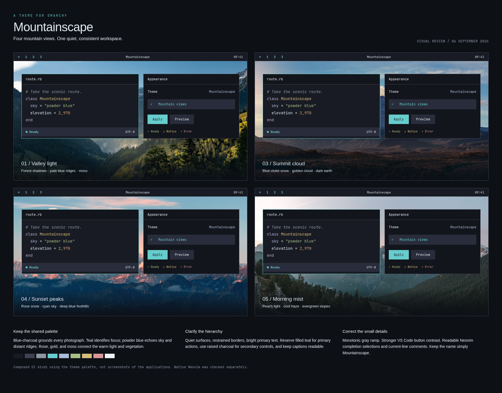
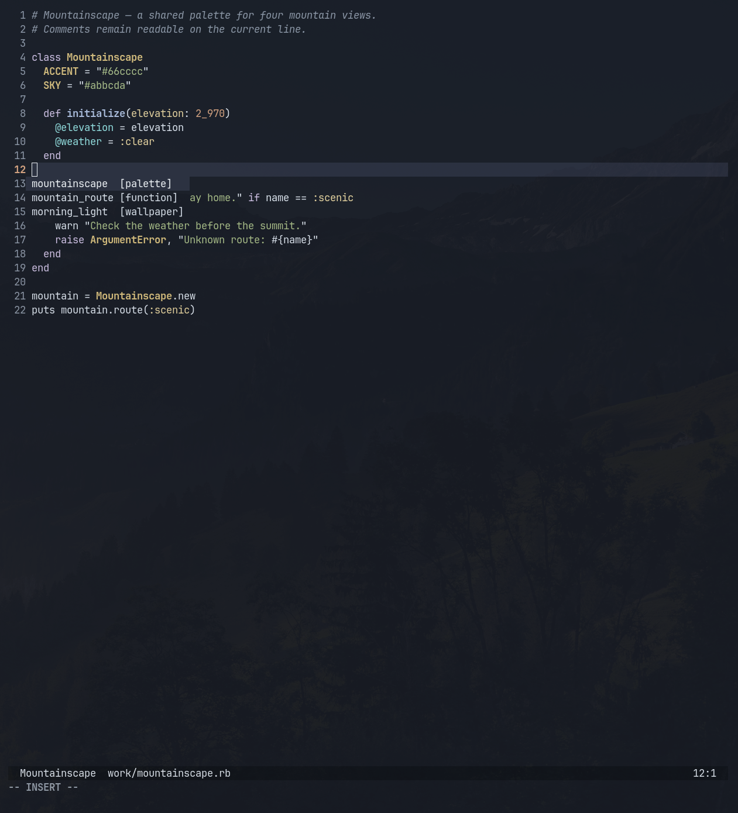

# Mountainscape visual review

Reviewed September 6, 2026 against all four supplied photographs, the active Omarchy 4.0.2 configuration, a composed interface comparison, and native Neovim in Foot. An independent AI design consultant also reviewed the photographs, comparison, and native editor view.

## Judgment

Keep **Mountainscape**, one word. It is a clear, compact landscape name. “Omarchy / Alpine Dark” was a descriptive preview label, not a second name; it has been replaced with “A theme for Omarchy.” Dark describes the application surfaces even when the wallpaper is bright.

The collection is cohesive. Its common language is cool mountain shadow, blue atmospheric distance, pale snow, and restrained warm light. The same palette works across all four photographs; switching wallpaper should not change syntax or interaction colors.

This is a composed comparison using the theme's colors. Its layouts are illustrative, not live app screenshots.

## Wallpaper fit

| Wallpaper | Character | Palette relationship |
| --- | --- | --- |
| mountainscape.jpg | Best default: valley light | Teal shadows and moss give the strongest relationship to the full palette. |
| mountainscape-03.jpg | Most dramatic: summit cloud | Blue-violet snow, golden clouds, and dark earth support blue, lavender, orange, and gold. |
| mountainscape-04.jpg | Most expressive: sunset peaks | Rose snow relates to the warm semantic colors; cyan sky and blue foothills keep it in the collection. |
| mountainscape-05.jpg | Calmest alternate: morning mist | Cool haze, evergreen slopes, and peach sunrise support the understated cool/warm balance. |

The brighter skies of 04 and 05 make dark windows more prominent. Opaque application surfaces and restrained accent use keep those views comfortable. Do not add transparency to the theme. Existing desktop opacity preferences remain the user's choice. In future promotional shots, leave 03's summit unobstructed; the comparison intentionally keeps layouts identical.

## What changed

- The foreground ramp now increases steadily in brightness. `light_foreground` changed from `#abbcda` to `#e6ebf2`. Powder blue remains `blue = "#abbcda"`. This removes the backwards brightness step in btop's graph ramp.
- VS Code secondary and extension buttons use raised charcoal with light text, including readable hover states. Prominent filled controls use dark text. Active command-center and toolbar surfaces use raised charcoal. Progress tracks are dark enough for teal progress indicators to stand out.
- A small, locally installed Neovim plugin spec changes Aether's completion selections and current-line shading to raised charcoal. This prevents the upstream blended surfaces from washing out comments and completion details. It is guarded by Mountainscape's background/accent and preserves existing highlight callbacks. Other palettes are unchanged.
- The preview naming is now unambiguous: **Mountainscape — A theme for Omarchy**.

## Skinning approach

The palette remains the common source for Omarchy's shell, terminals, editor syntax, btop, browser tint, and other supported integrations. Teal identifies focus and primary actions. Powder blue supplies secondary emphasis; green, gold, and rose retain distinct status meanings. Near-black and raised charcoal establish surface hierarchy without a second set of decorative colors.

Most app configurations still come directly from Omarchy. The VS Code exception is a color-only generated file with a checked-in template and a regeneration command, preserving targeted contrast fixes. Its template is based on Omarchy 4.0.2 and should be reviewed on upgrade. The Neovim exception is an optional manual plugin spec because downloaded themes cannot automatically load Lua. Installation and removal are documented in the README.

GTK receives Omarchy's standard dark appearance and Yaru-blue icons. Arbitrary GTK content and third-party websites are not recolored. The browser policy was verified as `#181b23` during this review.

## Verification

| Combination | Contrast |
| --- | ---: |
| Main text / main surface | 13.31:1 |
| Comments / main surface | 5.77:1 |
| Comments / corrected current line | 4.59:1 |
| Terminal selected text / selection | 8.93:1 |
| btop selected teal text / selection | 5.24:1 |
| VS Code secondary button text / normal fill | 10.60:1 |
| VS Code secondary button text / hover fill | 7.69:1 |
| Neovim selected completion text / fill | 12.30:1 |
| Neovim selected completion match / fill | 7.22:1 |

Ratios are calculated from opaque palette values. Compositor opacity can change rendered contrast. All four original images remain byte-for-byte unchanged. Generated JSON/TOML, Foot's configuration, the Neovim plugin integration, and Hyprland configuration were checked. Native Neovim code and a completion popup were visually inspected in Foot:

This is a real application capture using a review buffer and the installed Aether palette. VS Code controls were reviewed through generated color pairs and the composed study; every application, editor plugin, and interaction state was not exercised live. This is a focused visual and implementation review, not a claim of exhaustive accessibility certification.
